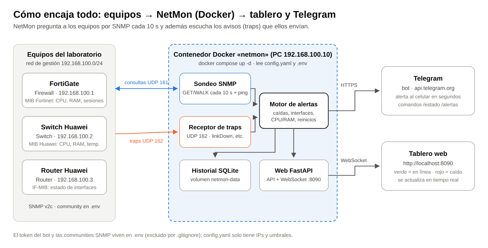
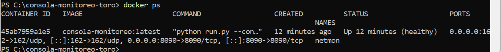
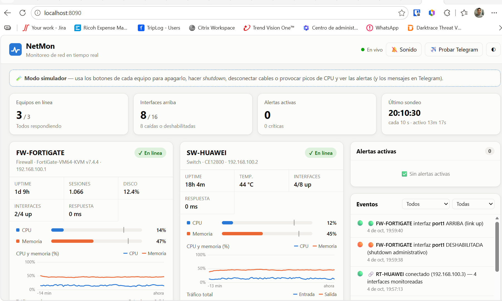
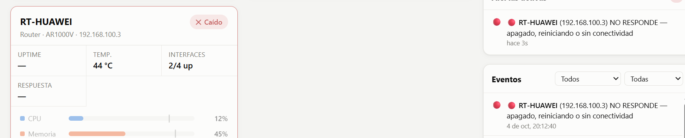
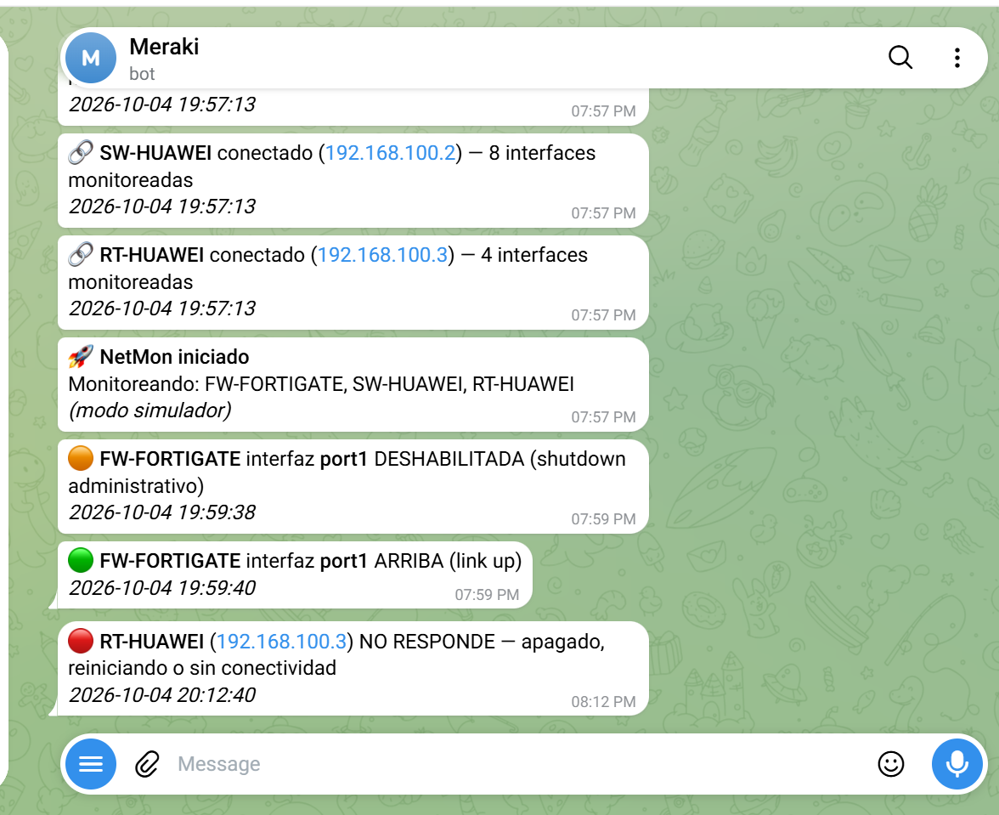

# Consola de monitoreo (NetMon)

**Autor:** Ronald Toro · **Proyecto:** Corte 2 · **Repositorio:** `consola-monitoreo-toro`

NetMon es una consola de monitoreo propia, escrita en Python y desplegada con **Docker**. Vigila por **SNMP** un firewall **FortiGate**, un **switch Huawei** y un **router Huawei**, y muestra su estado en un **tablero web en tiempo real**. Cuando un equipo se cae o una interfaz se desconecta, envía una **alerta a Telegram**.



---

## 1. Qué hace

- Consulta cada equipo por SNMP cada 10 s: uptime, CPU, memoria, temperatura, sesiones y el estado y tráfico de cada interfaz.
- Recibe **traps SNMP** (UDP 162) para reaccionar en segundos cuando cae un enlace.
- Muestra un **tablero web** (http://localhost:8090):
  - cada equipo en **verde** (en línea) o en **rojo** (caído);
  - gráficas de la última hora;
  - alertas activas e historial de eventos.
- Envía **alertas a Telegram** y responde a los comandos `/estado`, `/interfaces <equipo>` y `/alertas`.
- Guarda el historial de eventos en **SQLite**, dentro de un volumen de Docker.

## 2. Equipos monitoreados

| Equipo | Rol | IP de gestión | Qué se lee por SNMP |
|---|---|---|---|
| FortiGate | Firewall | 192.168.100.1 | CPU, memoria, sesiones, disco (FORTINET-FORTIGATE-MIB), interfaces |
| Huawei S57xx | Switch | 192.168.100.2 | CPU, memoria, temperatura (HUAWEI-ENTITY-EXTENT-MIB), interfaces |
| Huawei AR | Router | 192.168.100.3 | CPU, memoria, temperatura, interfaces |
| PC con Docker | Servidor NetMon | 192.168.100.10 | — |

La configuración SNMP de cada equipo está en [`configs/`](configs/).

## 3. Alertas que envía

| Evento | Cómo se detecta | Severidad |
|---|---|---|
| Equipo apagado o sin conexión | Fallan SNMP y ping 2 veces seguidas | 🔴 Crítica |
| Equipo que vuelve (avisa si se reinició) | Responde de nuevo; se revisa el uptime | 🟢 Info |
| Interfaz caída (cable o extremo apagado) | `ifOperStatus` o trap linkDown | 🔴 Crítica |
| Interfaz en `shutdown` | `ifAdminStatus` | 🟠 Advertencia |
| Interfaz que vuelve a subir | `ifOperStatus` | 🟢 Info |
| CPU, memoria, temperatura o disco altos | Umbral superado 2 sondeos seguidos | 📈 Advertencia |
| Responde ping pero no SNMP | Community o ACL mal configurada | ⚠️ Advertencia |

## 4. Requisitos

- **Docker Desktop** (Windows/Mac) o Docker Engine con el plugin `docker compose` (Linux).
- Un PC conectado a la red de gestión de los equipos y con salida a Internet (para Telegram).
- Un bot de Telegram creado con **@BotFather**.

## 5. Instalación y ejecución

```bash
git clone https://github.com/<tu-usuario>/consola-monitoreo-toro.git
cd consola-monitoreo-toro

# 1. Secretos: copiar la plantilla y llenar token, chat_id y communities
cp .env.example .env          # en Windows: copy .env.example .env
#    (editar .env con el Bloc de notas)

# 2. Equipos: revisar las IPs en config.yaml

# 3. Levantar el contenedor
docker compose up -d --build

# 4. Verificar
docker ps
```

Luego abre **http://localhost:8090**.

**Otros comandos:**

| Comando | Para qué |
|---|---|
| `docker compose logs -f` | Ver eventos en vivo |
| `docker compose restart` | Reiniciar después de cambiar `config.yaml` o `.env` |
| `docker compose down` | Detener |

**Sin equipos (modo simulador):** pon `NETMON_SIMULATE=1` en `.env` y reinicia el contenedor. Aparecen equipos virtuales con botones para apagarlos o desconectar interfaces.

## 6. Configuración

| Archivo | Contenido | ¿Se sube a GitHub? |
|---|---|---|
| `.env` | Token de Telegram, chat_id, communities SNMP | **No** (está en `.gitignore`) |
| `.env.example` | Plantilla de `.env` con valores de ejemplo | Sí |
| `config.yaml` | Equipos, IPs, umbrales, intervalos | Sí (no tiene secretos: usa `${VARIABLES}`) |
| `docker-compose.yml` | Servicio, puertos 8090/tcp y 162/udp, volumen | Sí |

## 7. Capturas

| | |
|---|---|
| **01 · Contenedor corriendo** (`docker ps`) | **02 · Tablero con los equipos en verde** |
|  |  |
| **03 · Un equipo caído (en rojo)** | **04 · Alerta recibida en Telegram** |
|  |  |

El informe completo está en [`docs/informe-corte2.pdf`](docs/informe-corte2.pdf).

## 8. Estructura del proyecto

```
├── docker-compose.yml      servicio "netmon" (puertos, volumen, .env)
├── Dockerfile              imagen Python 3.12 + ping + zona horaria
├── config.yaml             equipos del laboratorio
├── .env.example            plantilla de secretos (el .env real no se sube)
├── run.py                  punto de entrada
├── netmon/
│   ├── config.py           carga config.yaml + variables de .env
│   ├── snmp.py             cliente SNMP v2c/v3 (pysnmp)
│   ├── drivers.py          OIDs de FortiGate, Huawei y genérico
│   ├── monitor.py          sondeo, ping y motor de alertas
│   ├── traps.py            receptor de traps UDP 162
│   ├── telegram.py         alertas y comandos del bot
│   ├── store.py            historial en SQLite
│   ├── web.py              API REST + WebSocket (FastAPI)
│   ├── sim.py              equipos simulados
│   └── static/             tablero (HTML/CSS/JS)
├── configs/                configuración SNMP de FortiGate y Huawei
└── docs/                   diagrama, informe PDF y capturas
```

## 9. Seguridad

- Ningún token ni contraseña se sube al repositorio. Todos los secretos viven en `.env`, que está excluido por `.gitignore`.
- SNMP es **solo lectura**, y en los equipos una ACL o una lista de `hosts` restringe el acceso a la IP del servidor NetMon.
- El monitoreo se ejecuta únicamente sobre los equipos autorizados del laboratorio.

## 10. Solución de problemas

| Síntoma | Causa probable |
|---|---|
| ⚠️ "responde ping pero NO SNMP" | La community de `.env` no coincide con la del equipo, o la ACL no incluye la IP del PC. |
| No llegan alertas a Telegram | Token o chat_id incorrectos en `.env`. Revísalo con `docker compose logs`. |
| El puerto 8090 u 162 está ocupado | Otro programa lo usa. Cambia el puerto publicado en `docker-compose.yml`. |
